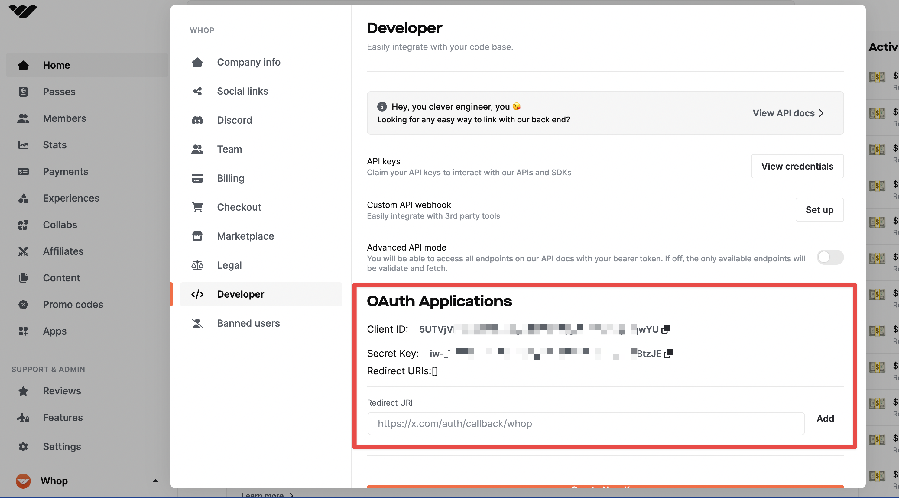

import QuickstartCard from "@components/QuickstartCard";
import TwitterCard from "@components/ShareOnTwitterCard";
import IntegrationPoints from "../../../src/components/getting-started/IntegrationPoints";

Selling on Whop.com is easy. If you're a developer with a business account on dash.whop.com, follow these steps to get started:

1. Retrieve your API keys from the "Developer" section on your dashboard settings page.

2. Set up Whop OAuth2. This will allow users to log in and access their memberships after purchasing. Refer to our guide for help with this.

3. Once OAuth2 is set up, check if a user holds a pass using the /me/has_access/:id endpoint. You can find the documentation for this endpoint here.

4. Customize the user's experience on your app by pulling in their profile using the /me endpoint and displaying it on their dashboard. This can include their username, social accounts, profile picture, and other details.

5. Every time a user accesses your app, check if they still have access by checking if they hold the pass.

By following these steps, you can easily sell your app on Whop.com and provide a seamless experience for your users. We recommend using our JavaScript SDK to interact with the API.

### Starter Kits

<IntegrationPoints />

<TwitterCard
  text={`I am using @WhopIO new docs and they are fire for my app! 🔥>`}
/>
