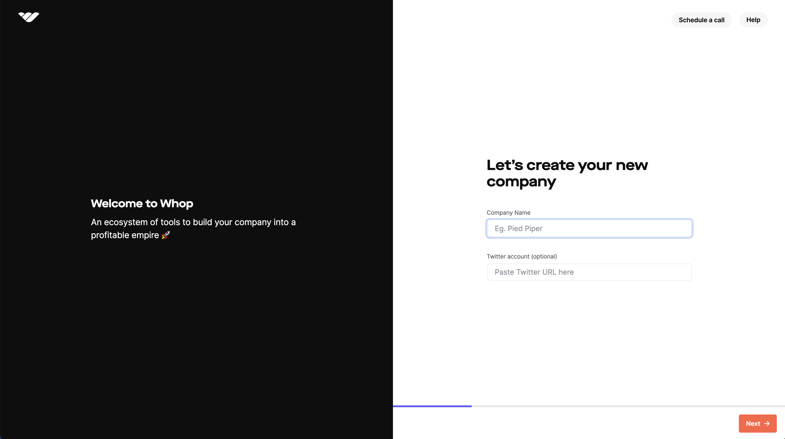

import TwitterCard from "@components/ShareOnTwitterCard";
import ProductCard from "../../../src/components/landing-page/ProductCard";

Whop is an all in one platform for merchants to sell access to digital products.
Thousands of software developers, content creators, traders, and savvy internet folks
use Whop to sell software, web apps, Discord servers, courses, files and many other
digital things. Selling access to your software/app/website/etc has **never been easier**, Whop's API
and OAuth implementation mean you can start getting paid for your work with only a few lines of code.

To begin integrating with Whop, you'll first need to make sure you've created a company on the [Whop Dashboard](https://dash.whop.com).

It'll be easiest to create a free `Plan` that you can purchase as a test. Click the **Add pricing option** button on the right side of the [home screen](https://dash.whop.com/home?welcome=true), and click on the **Free to join** option to properly setup the `Plan`. Before you save, head to the `visibility` tab to make the `Plan` `hidden` so only you can access it while testing.

  Once you have a company set up, the next steps depend on your end goal:

- If you want to setup integrations with Whop to start collecting payments **fast**, we recommend checking out our [Webhook Integration guide](/getting-started/integrate-via-webhooks)
- If you're looking to build out a more in-depth integration for your users, our [OAuth/API Integration guide](/getting-started/integrate-via-api) will lead you through every step of setting up a project using Whop OAuth and API

### Next steps:

  

    

      <ProductCard
        image={"/assets/getting-started/quick-integration.png"}
        name={"Quick Integration Guide"}
        description={"Get started with Whop Webhooks in 15 minutes"}
        link={"/getting-started/integrate-via-webhooks"}
      />
    

    

      <ProductCard
        image={"/assets/getting-started/full-integration.png"}
        name={"Full Integration Guide"}
        description={
          "Take control with the full power of the Whop API and OAuth"
        }
        link={"/getting-started/integrate-via-api"}
      />
    

  

<TwitterCard
  text={`I am using @WhopIO new docs and they are fire for my app! 🔥`}
/>

## Finish Setup

After you've completed your developer integration, you'll want to head back to the [dashboard](https://dash.whop.com/home) to configure your product page, pricing options, and payment methods.
We strongly encourage you check out our [non-technical user guides](https://docs.whop.com/biz-2.0/walkthrough/overview) that will explain everything the dashboard has to offer to help you manage and grow your business.
