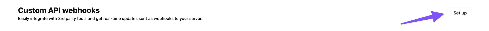

# Quick Integration

Follow this guide to easily integrate with Whop's membership platform using webhooks.

1. [Go to your dashboard](https://dash.whop.com/developer) and set up your webhooks. Input the URL and send a test webhook for confirmation.

2. Once it's set up, we'll send a webhook to you whenever a membership is created. The webhook will include relevant user information, allowing you to customize your experience. [Click here](/webhooks#membership-goes-valid) to see an example of the webhook

3. We'll also send you a webhook when a membership is no longer valid so you can remove access on your end.

With this, you can easily verify the membership of any user on Whop and take the desired actions in your application.