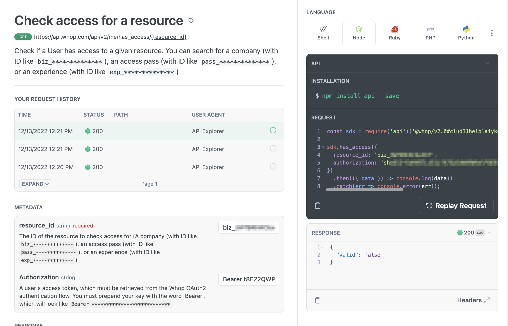
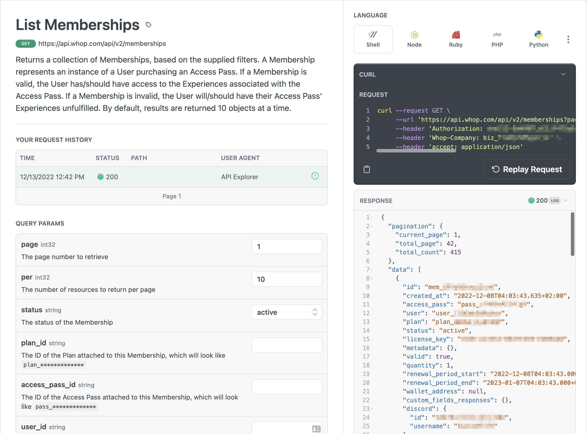

import IntegrationPoints from "../../../src/components/getting-started/IntegrationPoints";

Integrating with Whop and the Whop API is easy. If you're a developer with a business account on [our dashboard](https://dash.whop.com), follow these steps to get started:

### Authentication

Navigate to your [Whop Developer settings](https://dash.whop.com/developer) retrieve your API key or OAuth2 credentials. Not sure which method to use?

- Whop OAuth allows users to authenticate themselves through Whop, and allows you to make API requests **client-side** on behalf of them. This is important for when you need to ensure the user is really who they say they are.
  Refer to the [OAuth2 Implementation guide](/authentication/oauth) for a more in-depth explanation on using OAuth.

- For any kind of logic you want to do **server-side**, authentication with API keys is the way to go. This means if you are using Whop OAuth, there is also a chance you will be using API key.


### Gating Access with OAuth

1. First, you will need to send your users to the Whop OAuth Portal, which might look something like this:

```
https://whop.com/oauth?client_id=YOUR_CLIENT_ID&redirect_uri=YOUR_REDIRECT_URI
```

2. Once the user has authenticated themselves on the Whop OAuth Portal, they will be redirected back to the redirect_uri specified. This link will look something like this:
```
https://your_redirect_uri.com/auth/whop/callback?code=RANDOM_AUTH_CODE
```

3. Once you have this code, you will need to make a POST request to `https://data.whop.com/oauth/token`, in order to exchange this code (shown in the example as `RANDOM_AUTH_CODE`) for a full authorization token.

Once your OAuth implementation is working and users are authenticated, check if a user holds a pass using the `/me/has_access/:id` endpoint. You can find the documentation for this endpoint [here](https://dev.whop.com/reference/has_access).



Customize the user's experience on your app by pulling in their profile using the various `/me` endpoints and displaying that info on your app. This can include their username, social accounts, profile picture, and other details.

For example, every time a user accesses your app, you might want to retrieve their personalization info from the [Retrieve Profile](https://dev.whop.com/reference/retrieve_profile) endpoint.
Then, check if they still have access to your app (by checking if they hold your **Access Pass** using the [Has Access](https://dev.whop.com/reference/has_access) endpoint). 
Now you know the identity of the user, as well as their access level, and can conditionally show them your software (assuming they are a holder).

### Server-Side Integration

Making any kind of script, software tool, or admin panel is simple with Whop API's server-side endpoints. Using one of our `list` endpoints, such as [List Memberships](https://dev.whop.com/reference/list_memberships),
you can iterate over resources and take action based on logic you implement.



### NextJS Template

- If you just want to dive in to some code, our [NextJS Template App](/nextjs) is an easy solution. Built on the lastest version of NextJS, this template app is already optimized for integrations with Whop, letting you focus on what's important to your customers

<IntegrationPoints />
