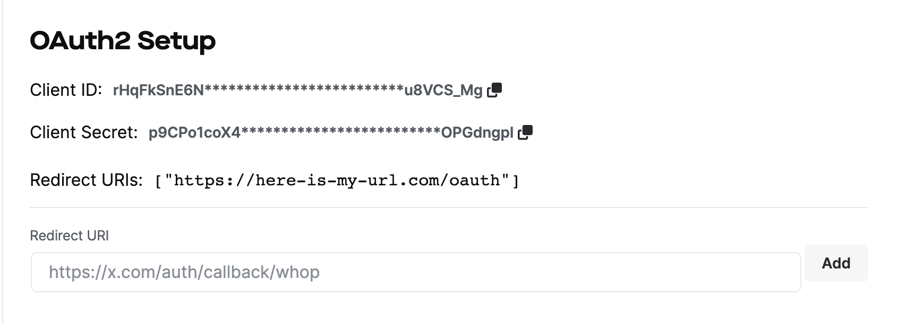

import IntegrationPoints from "../../../src/components/getting-started/IntegrationPoints";

# Integrate via API

Integrating with Whop and the Whop API is easy. If you're a developer with a business account on [our dashboard](https://dash.whop.com), follow these steps start selling access to your software/app.

### Prerequisites
To start the integration process, you'll need to find a way to authenticate users and verify they have access to your product.
To implement OAuth2 through Whop, you will need to head to your [developer settings page](https://dash.whop.com/developer) to obtain your Client ID and Client Secret.
These keys will be used to identify your website/app and authenticate it to the Whop API.
In order to complete the OAuth setup process, you must also specify a redirect URL.
This URL should be an endpoint on your website that is specifically designed to receive responses from the service.
Once you receive a response, you can use the user's access tokens to grant them access to the requested resources.


### Implementing Whop OAuth

First, you will need to send your users to the Whop OAuth Portal. You can do this by having the user click a login button, which might look something like this:

```
<a href={`https://whop.com/oauth?client_id=${process.env.CLIENT_ID}&redirect_uri=${process.env.REDIRECT_URI}`}>
    <button>Login with Whop</button>
</a>
```

After being redirected, the user will be prompted to sign in with their existing Whop account (or to create a new one)

Once the user has authenticated themselves on the Whop OAuth Portal, they will be redirected back to the redirect_uri specified. This link will look something like this:

```
https://your_redirect_uri.com/auth/whop/callback?code=RANDOM_AUTH_CODE
```

Once you have this code, you will need to make a `POST` request to Whop, in order to exchange this code for a full authorization token.

```
let response = await fetch("https://data.whop.com/oauth/token", {
    method: 'POST',
    headers: {
        'Content-Type': 'application/json'
    },
    body: JSON.stringify({
      code: RANDOM_AUTH_CODE,
      client_id: process.env.CLIENT_ID,
      client_secret: process.env.CLIENT_SECRET,
      redirect_uri: process.env.REDIRECT_URI,
      grant_type: "authorization_code"
    })
}

let parsed_response = response.json()
let access_token = parsed_response.access_token
```

And now your user is authenticated! You can store this access token as a cookie or store it elsewhere, and use to make requests client-side (using this access token in the Authorization header of your requests).

### Gating Access to your Software/App

Now that your OAuth implementation is working and users are authenticated, check if a user holds a pass using the `/me/has_access/:id` endpoint. You can find the documentation for this endpoint [here](https://dev.whop.com/reference/has_access).

- Checking for access on a **Company** level (by passing a `biz_*************` ID) will tell you if a user has any valid memberships under the specified company.
- Checking for access on an **Access Pass** level (by passing a `pass_*************` ID) will tell you if a user has any valid memberships under the specified access pass.
- Checking for access on an **Experience** level (by passing an `exp_*************` ID) will tell you if a user has any valid memberships that give access to the specified experience.


Customize the user's experience on your app by pulling in their profile using the various `/me` endpoints and displaying that info on your app. This can include their username, social accounts, profile picture, and other details.

For example, every time a user accesses your app, you might want to retrieve their personalization info from the [Retrieve Profile](https://dev.whop.com/reference/retrieve_profile) endpoint.
Then, check if they still have access to your app (by checking if they hold your **Access Pass** using the [Has Access](https://dev.whop.com/reference/has_access) endpoint).
Now you know the identity of the user, as well as their access level, and can conditionally show them your software/app.

### NextJS Template

- If you don't want to bother with RESTful requests and just want to dive in to some code, our [NextJS Template App](/nextjs) is the perfect solution.
  Built on the latest version of NextJS, this template app is already optimized for integrations with Whop (using our JavaScript and Typescript SDK), letting you focus on what's important to your customers

<IntegrationPoints />
